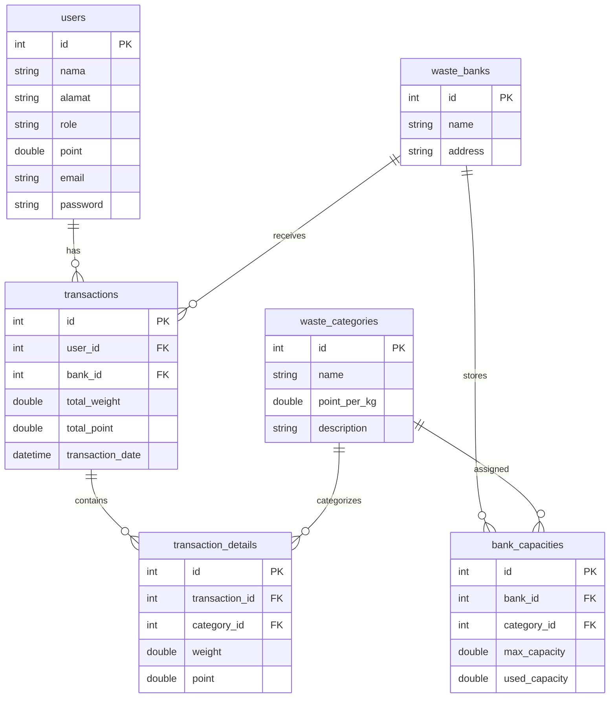
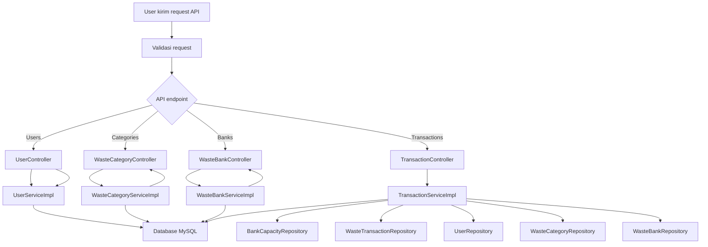

# SetorSampah Backend

SetorSampah adalah aplikasi backend Spring Boot untuk sistem digital bank sampah. Proyek ini menyediakan REST API untuk manajemen user, kategori sampah, bank sampah, kapasitas kategori, transaksi setoran sampah, dan dashboard ringkas.

## Teknologi
- Java 17
- Spring Boot 4.0.6
- Spring Data JPA
- MySQL
- Maven
- Lombok
- Jakarta Validation

## Struktur Proyek
- `src/main/java/com/example/setorsampah/controller` - REST controller
- `src/main/java/com/example/setorsampah/service` - service interface dan implementasi
- `src/main/java/com/example/setorsampah/repository` - JPA repository
- `src/main/java/com/example/setorsampah/model` - entity JPA
- `src/main/java/com/example/setorsampah/dto` - request / response DTO
- `src/main/java/com/example/setorsampah/mapper` - konversi entity <-> DTO
- `src/main/java/com/example/setorsampah/exception` - global exception handling
- `src/main/java/com/example/setorsampah/config` - konfigurasi aplikasi

## Konfigurasi Database
Atur koneksi MySQL di `src/main/resources/application.properties`:

```properties
spring.datasource.url=jdbc:mysql://localhost:3306/setorsampah
spring.datasource.username=root
spring.datasource.password=
spring.datasource.driver-class-name=com.mysql.cj.jdbc.Driver
spring.jpa.hibernate.ddl-auto=update
spring.sql.init.mode=always
```

## Menjalankan Aplikasi
Pastikan MySQL berjalan dan database `setorsampah` tersedia, lalu jalankan:

```bash
./mvnw spring-boot:run
```

## API Endpoint Utama
- `GET /api/users` - daftar user dengan pagination dan pencarian
- `POST /api/users` - tambah user baru
- `GET /api/users/{id}` - ambil user berdasarkan ID
- `PUT /api/users/{id}` - update user
- `DELETE /api/users/{id}` - hapus user

- `GET /api/categories` - daftar kategori sampah dengan pagination
- `POST /api/categories` - tambah kategori sampah
- `GET /api/categories/{id}` - ambil kategori
- `PUT /api/categories/{id}` - update kategori
- `DELETE /api/categories/{id}` - hapus kategori

- `GET /api/waste-banks` - daftar bank sampah
- `POST /api/waste-banks` - tambah bank sampah
- `GET /api/waste-banks/{id}` - detail bank sampah
- `PUT /api/waste-banks/{id}` - update bank sampah
- `POST /api/waste-banks/{id}/capacities` - tambah kapasitas kategori di bank
- `GET /api/waste-banks/{id}/capacities` - list kapasitas bank
- `PUT /api/waste-banks/capacities/{capacityId}` - update kapasitas

- `POST /api/transactions` - buat transaksi setoran sampah
- `GET /api/transactions` - daftar transaksi
- `GET /api/transactions/{id}` - transaksi by ID
- `GET /api/transactions/users/{userId}` - transaksi user
- `GET /api/transactions/banks/{bankId}` - transaksi bank

- `GET /api/dashboard/summary` - ringkasan total pengguna, transaksi, sampah, dan poin

## ERD Database


## Flowchart Sistem

