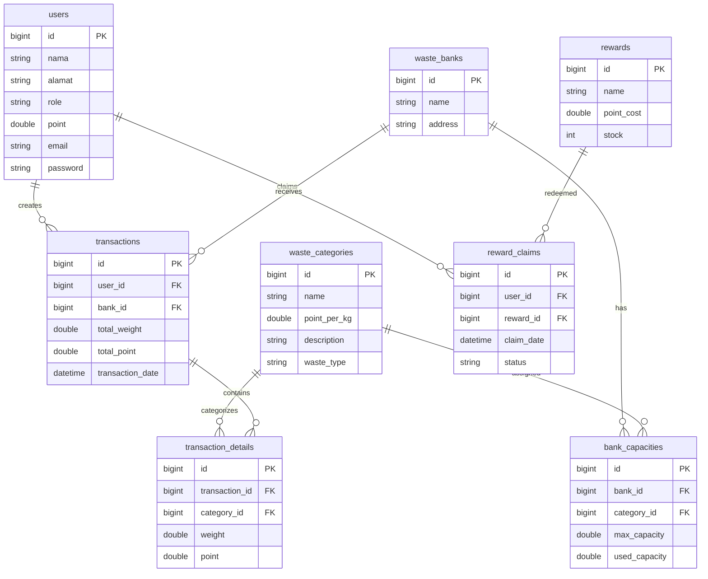

# SetorSampah Backend

SetorSampah adalah platform manajemen bank sampah digital berbasis REST API. Aplikasi ini mendukung manajemen user, kategori sampah, bank sampah, transaksi setoran, akumulasi poin, pelaporan, dan penukaran reward.

## Teknologi

- Java 17
- Spring Boot 4.0.6
- Spring Data JPA
- Spring Security + JWT
- MySQL
- Maven
- Lombok
- Jakarta Validation
- JUnit 5

## Struktur Proyek

```
src/main/java/com/example/setorsampah/
├── config/          # Security, JWT filter, password initializer
├── controller/      # REST endpoints
├── dto/             # Request & response objects
├── exception/       # Global exception handler
├── mapper/          # Entity ↔ DTO conversion
├── model/           # JPA entities (User inheritance, Reward, dll.)
├── repository/      # Spring Data JPA repositories
├── security/        # UserPrincipal, SecurityUtils
└── service/         # Business logic
```

## Instalasi & Database Setup

### Prasyarat

- JDK 17+
- MySQL 8.x

### Buat Database

```sql
CREATE DATABASE setorsampah;
```

### Konfigurasi

Edit `src/main/resources/application.properties`:

```properties
spring.datasource.url=jdbc:mysql://localhost:3306/setorsampah
spring.datasource.username=root
spring.datasource.password=
spring.jpa.hibernate.ddl-auto=update
spring.sql.init.mode=always
jwt.secret=SetorSampahSecretKeyForJwtTokenGeneration2026SecureKey
jwt.expiration-ms=86400000
```

## Menjalankan Aplikasi

```bash
./mvnw spring-boot:run
```

Aplikasi berjalan di `http://localhost:8080`

## JWT Authentication

Semua endpoint (kecuali login) memerlukan header:

```
Authorization: Bearer <jwt-token>
```

### Login

```http
POST /api/auth/login
Content-Type: application/json

{
  "email": "admin@setorsampah.id",
  "password": "admin123"
}
```

**Response:**

```json
{
  "token": "eyJhbGciOiJIUzI1NiIsInR5cCI6IkpXVCJ9..."
}
```

### Akun Sample (data.sql)

| Email | Password | Role |
|-------|----------|------|
| admin@setorsampah.id | admin123 | ADMIN |
| budi@example.com | password | WARGA |

Password di-hash otomatis dengan BCrypt saat startup pertama.

## Role Authorization

| Role | Hak Akses |
|------|-----------|
| **ADMIN** | CRUD kategori, bank sampah, kapasitas, reward; hapus transaksi; kelola user |
| **WARGA** | Lihat data, buat transaksi, lihat riwayat sendiri, tukar reward |

## API Documentation

### Users — `/api/users`

| Method | Endpoint | Role | Deskripsi |
|--------|----------|------|-----------|
| GET | `/api/users` | Auth | Daftar user (pagination) |
| GET | `/api/users/{id}` | Auth | Detail user |
| POST | `/api/users` | ADMIN | Buat user |
| PUT | `/api/users/{id}` | ADMIN | Update user |
| DELETE | `/api/users/{id}` | ADMIN | Hapus user |

### Categories — `/api/categories`

| Method | Endpoint | Role | Deskripsi |
|--------|----------|------|-----------|
| GET | `/api/categories` | Auth | Daftar kategori |
| POST | `/api/categories` | ADMIN | Buat kategori |
| PUT | `/api/categories/{id}` | ADMIN | Update kategori |
| DELETE | `/api/categories/{id}` | ADMIN | Hapus kategori |

**Request body contoh:**

```json
{
  "name": "Plastik",
  "pointPerKg": 5.0,
  "description": "Sampah plastik",
  "wasteType": "ANORGANIK"
}
```

### Waste Banks — `/api/waste-banks`

| Method | Endpoint | Role |
|--------|----------|------|
| GET | `/api/waste-banks` | Auth |
| POST | `/api/waste-banks` | ADMIN |
| PUT | `/api/waste-banks/{id}` | ADMIN |
| DELETE | `/api/waste-banks/{id}` | ADMIN |
| POST | `/api/waste-banks/{id}/capacities` | ADMIN |
| GET | `/api/waste-banks/{id}/capacities` | Auth |
| PUT | `/api/waste-banks/capacities/{capacityId}` | ADMIN |

### Transactions — `/api/transactions`

| Method | Endpoint | Role |
|--------|----------|------|
| POST | `/api/transactions` | WARGA |
| GET | `/api/transactions` | Auth |
| GET | `/api/transactions/{id}` | Auth |
| GET | `/api/transactions/users/{userId}` | Auth (own history for WARGA) |
| GET | `/api/transactions/banks/{bankId}` | Auth |
| DELETE | `/api/transactions/{id}` | ADMIN |

**Contoh create transaction:**

```json
{
  "userId": 2,
  "bankId": 1,
  "items": [
    { "categoryId": 1, "weight": 10.0 }
  ]
}
```

Warga mendapat bonus poin 10% dari total transaksi (polimorfisme `calculateBonusPoint()`).

### Rewards — `/api/rewards`

| Method | Endpoint | Role |
|--------|----------|------|
| GET | `/api/rewards` | Auth |
| POST | `/api/rewards` | ADMIN |
| PUT | `/api/rewards/{id}` | ADMIN |
| DELETE | `/api/rewards/{id}` | ADMIN |

### Claims — `/api/claims`

| Method | Endpoint | Role |
|--------|----------|------|
| POST | `/api/claims` | WARGA |
| GET | `/api/claims/user/{userId}` | Auth (own history for WARGA) |

**Contoh claim reward:**

```json
{
  "userId": 2,
  "rewardId": 1
}
```

### Reports — `/api/reports`

```http
GET /api/reports/total-waste
Authorization: Bearer <token>
```

**Response:**

```json
{
  "success": true,
  "message": "Laporan total sampah berhasil diambil",
  "data": {
    "organik": 120.5,
    "anorganik": 330.2,
    "b3": 10.7,
    "total": 461.4
  }
}
```

### Dashboard — `/api/dashboard/summary`

Ringkasan total user, transaksi, berat sampah, dan poin.

## OOP Design

```
User (abstract) implements PointCalculatable
├── Admin   → calculateBonusPoint() = 0, canProcessTransaction() = false
└── Warga   → calculateBonusPoint() = 10% bonus, canProcessTransaction() = true
```

- **Inheritance:** JPA SINGLE_TABLE dengan kolom `role` sebagai discriminator
- **Polymorphism:** `calculateBonusPoint()` dan `canProcessTransaction()` di-override per subclass
- **Abstraction:** Interface `PointCalculatable` untuk kontrak perhitungan poin

## ERD



## Testing

```bash
./mvnw test
```

| Test | Tipe | Cakupan |
|------|------|---------|
| `TransactionServiceTest` | Unit | Bonus poin, delete rollback, validasi admin |
| `RewardClaimServiceTest` | Unit | Deduction poin/stok, validasi saldo |
| `AuthIntegrationTest` | Integration | Login JWT, proteksi endpoint |
| `TransactionIntegrationTest` | Integration | Create transaksi oleh WARGA |
| `RewardClaimIntegrationTest` | Integration | Claim reward end-to-end |

Tests menggunakan H2 in-memory database (`src/test/resources/application.properties`).
